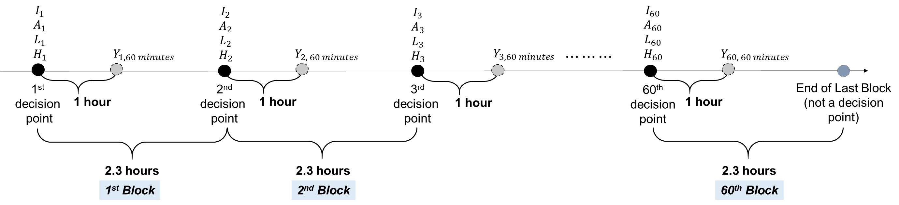

```{r setup, include=FALSE}
knitr::opts_chunk$set(echo = TRUE, warning = FALSE)
```

```{r global_options, include=FALSE}
knitr::opts_chunk$set(fig.pos = 'H')
```


```{r, echo = FALSE, message = FALSE}
library(rmarkdown)
library(knitr)
library(kableExtra)
library(dplyr)
```


This documentation is a supplement to the manuscript titled `The Mobile-Assistance for Regulating Smoking (MARS) Micro-Randomized Trial Design Protocol' (Nahum-Shani, et al., 2021), submitted for consideration to the Journal of Contemporary Clinical Trials. In this documentation, we describe the set-up and results of the power calculation for the Primary Aim and Secondary Aim of the MARS Micro-Randomized Trial. Where relevant, we direct readers to R code files.

The work in this documentation was funded by NIH grant U01CA229437 and developed at the d3lab: https://d3lab.isr.umich.edu/

_Keywords: Causal Inference, Intensive Longitudinal Data, Adaptive Interventions, Mobile Health (mHealth), Micro-Randomized Trial, Power Calculation_

# Study Set-Up

* **Decision Point:** There are 6 decision points within each day of the 10-day Micro-Randomized Trial (MRT). Decision points are indexed by $t = 1, 2, 3, ..., 60$. The decision points are spread throughout the day, with approximately 2 hours between decision points.

* **Occurrence of Micro-Randomizations:** Due to practical and ethical considerations, micro-randomizations will not occur if driving is detected or if the participant activates 'sleep-mode' on the smartphone. $I_t = 1$ if micro-randomization at $t$ occurs, i.e., $I_t = 1$ if the participant is not driving and does not have 'sleep-mode' activated their mobile phone at $t$; $I_t = 0$, otherwise.

* **Primary Outcome:** The primary proximal outcome of the MRT is engagement in self-regulatory strategies (self-reported via a survey delivered on the participant's mobile phone) approximately 1 hour following micro-randomization. The primary proximal outcome is binary where $Y_{t,\ 60\ mins}=1$ denotes that the participant engaged in self-regulatory strategies within the next hour following decision point $t$; $Y_{t,\ 60\ mins}=0$, otherwise.

* **Interventions:** At each decision point $t$, a participant is randomized to be offered **no prompt** with probability 0.5, a prompt to engage in a relatively low effort self-regulatory strategy (which we refer to here as a **low effort prompt**)  with probability 0.25, and a prompt to engage in a relatively high effort self-regulatory strategy (which we refer to here as a **high effort prompt**)  with probability 0.25.

  * $A_t = 1$ if participant is randomized to **any kind of prompt** at $t$; $A_t = 0$ otherwise (i.e., participant is randomized to be offered **no prompt** at $t$)
  * $L_t = 1$ if participant is randomized to a **low effort prompt** at $t$; $L_t = 0$ otherwise (i.e., participant is randomized to either **no prompt** or a **high effort prompt**)
  * $H_t = 1$ if participant is randomized to a **high effort prompt** at $t$; $H_t = 0$ otherwise (i.e., participant is randomized to either **no prompt** or a **low effort prompt**)


\vspace{0.10in}


{#id .class width=105% height=105%}


# The Causal Effects

The causal effect of interest for the Primary Aim is

$$
\frac{Pr\left\{Y_{t,\ 60\ mins}=1 | A_t = 1, I_t = 1\right\}}{Pr\left\{Y_{t,\ 60\ mins}=1 | A_t = 0, I_t = 1\right\}}
$$

The above risk ratio is the probability (i.e., 'risk') of engaging in self-regulatory strategies in the next hour following decision point $t$, when the participant was randomized to **any kind of prompt** at $t$, relative to (i.e., divided by) the probability of engaging in self-regulatory strategies in the next hour following decision point $t$, when the participant was randomized to **no prompt** at decision point $t$

The causal effect of interest for the Secondary Aim is

$$
\frac{Pr\left\{Y_{t,\ 60\ mins}=1 | L_t = 1, H_t = 0, I_t = 1\right\}}{Pr\left\{Y_{t,\ 60\ mins}=1 | L_t = 0, H_t = 1, I_t = 1\right\}}
$$


The above risk ratio is the probability (i.e., 'risk') of engaging in self-regulatory strategies in the next hour following decision point $t$, when the participant was randomized to **low effort** prompt at decision point $t$, relative to (i.e., divided by) the probability of engaging in self-regulatory strategies in the next hour following decision point $t$, when the participant was randomized to **high effort** prompt at decision point $t$


# Models for Causal Relative Risk

We model the causal relative risk for the Primary Aim as

$$
\mathrm{log}\left(Pr\left\{Y_{t,\ 60\ mins}=1 | A_t, I_t = 1\right\}\right) = \beta_0 + \beta_1 A_t
$$

and for the Secondary Aim as

$$
\mathrm{log}\left(Pr\left\{Y_{t,\ 60\ mins}=1 | L_t, H_t, I_t = 1\right\}\right) = \theta_0 + \theta_1 L_t + \theta_2 H_t
$$

In other words, the Primary Aim risk ratio based on the model can be expressed as: 


$$
\frac{Pr\left\{Y_{t,\ 60\ mins}=1 | A_t = 1, I_t = 1\right\}}{Pr\left\{Y_{t,\ 60\ mins}=1 | A_t = 0, I_t = 1\right\}} = \frac{e^{\beta_0 + \beta_1}}{e^{\beta_0}} = e^{\beta_1}
$$

Similarly, the Secondary Aim risk ratio based on the model can be expressed as: 


$$
\frac{Pr\left\{Y_{t,\ 60\ mins}=1 | L_t = 1, H_t = 0, I_t = 1\right\}}{Pr\left\{Y_{t,\ 60\ mins}=1 | L_t = 0, H_t = 1, I_t = 1\right\}} = \frac{e^{\theta_0 + \theta_1}}{e^{\theta_0 + \theta_2}} = e^{\theta_1 - \theta_2}
$$

# Relationship between Parameters across Models

Now, we have that

$$
\begin{split}
Pr\left(Y_{t,\ 60\ mins}=1 | A_t = 0, I_t=1\right) &= e^{\beta_0}\\
Pr\left(Y_{t,\ 60\ mins}=1 | L_t = 0, H_t=0, I_t=1\right) &= e^{\theta_0}\\
Pr\left(Y_{t,\ 60\ mins}=1 | A_t = 1, I_t=1\right) &= e^{\beta_0 + \beta_1}\\
Pr\left(Y_{t,\ 60\ mins}=1 | L_t = 1, H_t=0, I_t=1\right) &= e^{\theta_0 + \theta_1}\\
Pr\left(Y_{t,\ 60\ mins}=1 | L_t = 0, H_t=1, I_t=1\right) &= e^{\theta_0 + \theta_2}\\
\end{split}
$$


Since $Pr\left(Y_{t,\ 60\ mins}=1 | A_t = 0, I_t=1\right)$ and $Pr\left(Y_{t,\ 60\ mins}=1 | L_t = 0, H_t=0, I_t=1\right)$ are equivalent, $\beta_0 = \theta_0$. Additionally, observe that since $Pr\left(Y_{t,\ 60\ mins}=1 | A_t = 1, I_t=1\right)$ is a weighted average of $Pr\left(Y_{t,\ 60\ mins}=1 | L_t = 1, H_t=0, I_t=1\right)$ and $Pr\left(Y_{t,\ 60\ mins}=1 | L_t = 0, H_t=1, I_t=1\right)$,

$$
\small
\begin{split}
e^{\beta_0 + \beta_1} &= Pr\left(Y_{t,\ 60\ mins}=1 | A_t=1, I_t=1\right) \\
&= Pr\left(Y_{t,\ 60\ mins}, L_t=1, H_t=0 | A_t=1, I_t=1\right) + Pr\left(Y_{t,\ 60\ mins}, L_t=0, H_t=1 | A_t=1, I_t=1\right)\\
&= Pr\left(Y_{t,\ 60\ mins}=1 | A_t=1, I_t=1, L_t=1, H_t=0\right) \cdot Pr\left(A_t=1, I_t=1, L_t=1, H_t=0\right) \\
&+Pr\left(Y_{t,\ 60\ mins}=1 | A_t=1, I_t=1, L_t=0, H_t=1\right) \cdot Pr\left(A_t=1, I_t=1, L_t=0, H_t=1\right)\\
&= \left(e^{\theta_0 + \theta_1}\right) \cdot \frac{1}{2} + \left(e^{\theta_0 + \theta_2}\right) \cdot \frac{1}{2}
\end{split}
$$

Since $e^{\beta_0} = e^{\theta_0}$, the above expression can be simplified to

$$
e^{\beta_1} = \left(e^{\theta_1}\right) \cdot \frac{1}{2} + \left(e^{\theta_2}\right) \cdot \frac{1}{2}
$$

Therefore,


$$
\begin{split}
\begin{cases}
\beta_0 &= \theta_0 \\
\beta_1 &= \mathrm{log}\left(\frac{1}{2}e^{\theta_1} + \frac{1}{2}e^{\theta_2}\right)
\end{cases}
\end{split}
$$

# Null and Alternative Hypotheses

The null and alternative hypotheses for the Primary Aim and the Secondary Aim can be expressed in terms of the parameters in the models for the causal relative risks. 

For the Primary Aim, the null and alternative hypotheses are

$$
H_0: \beta_1 = 0 \hspace{1cm} \text{vs.} \hspace{1cm} H_1: \beta_1 \neq 0
$$

For the Secondary Aim, the null and alternative hypotheses are

$$
H_0: \theta_1 - \theta_2 = 0 \hspace{1cm} \text{vs.} \hspace{1cm} H_1: \theta_1 - \theta_2 \neq 0
$$

# Hypothesis Test and Power

Let type-I error rate be denoted by $\alpha$ and $z_{1-\frac{\alpha}{2}}$ the $1-\frac{\alpha}{2}$ percentile of the standard normal distribution. Further, let $\boldsymbol{\hat{\beta}}$ and $\boldsymbol{\hat{\theta}}$ denote estimates of $\beta = \left(\beta_0, \beta_1\right)^T$ and $\theta = \left(\theta_0, \theta_1, \theta_2\right)^T$.

For the Primary Aim, $Z = \frac{\boldsymbol{L\hat{\beta}}}{\sqrt{\boldsymbol{L}\widehat{Var}(\boldsymbol{\hat{\beta}}) \boldsymbol{L}^T}}$ and $\boldsymbol{L} = (0,1)^T$; the null hypothesis will be rejected if 

$$
\left|Z \right| > z_{1 - \frac{\alpha}{2}}
$$

For the Secondary Aim, $Z = \frac{\boldsymbol{L\hat{\theta}}}{\sqrt{\boldsymbol{L}\widehat{Var}(\boldsymbol{\hat{\theta}})\boldsymbol{L}^T}}$ and $\boldsymbol{L} = (0,1,-1)^T$; the null hypothesis will be rejected if 

$$
\left|Z \right| > z_{1 - \frac{\alpha}{2}}
$$

Power for the Primary Aim and the Secondary Aim are then estimated using $\mathbbm{P}_M  \left(\mathbbm{1} \left(\left|Z \right| > z_{1 - \frac{\alpha}{2}}\right)\right)$ where $\mathbbm{P}_M$ denotes an empirical average across $M$ Monte Carlo simulations and $\mathbbm{1}$ is the indicator function. In `calc-power.R`, each of the $M$ synthetic datasets were generated using the function `GenerateData()`. Type 1 error rates for the Primary Aim and Secondary Aim are each set to $\alpha=0.05$. 

# Quantities Elicited from Domain Scientists

The following quantities serve as inputs to the simulation-based approach to power calculation and are to be elicited from domain scientists:

1. The probability that randomization will occur at decision point $t$, i.e., the probability that the participant is not driving and 'sleep-mode' is not activated at decision point $t$

2. The average within-person correlation, averaged only across decision points for which the participant was not driving and 'sleep-mode' was not activated.

3. The probability of engaging in self-regulatory strategies (self-reported) in the next hour following decision point $t$, when the participant was randomized to **no prompt** at decision point $t$:

$$
\color{blue}{Pr\left\{Y_{t,\ 60\ mins} = 1| A_t = 0, I_t = 1\right\}}
$$

4. The probability of engaging in self-regulatory strategies (self-reported) in the next hour following decision point $t$, when the participant was randomized to **low effort** prompt at decision point $t$:

$$
\color{blue}{Pr\left\{Y_{t,\ 60\ mins} = 1| L_t = 1, H_t = 0, I_t = 1\right\}}
$$

5. The probability of engaging in self-regulatory strategies (self-reported) in the next hour following decision point $t$, when the participant was randomized to **high effort** prompt at decision point $t$:

$$
\color{blue}{Pr\left\{Y_{t,\ 60\ mins} = 1| L_t = 0, H_t = 1, I_t = 1\right\}}
$$

In `calc-power.R`, the value of the latter three quantities are specified in the following lines of code. These lines specify that $\color{blue}{Pr\left\{Y_{t,\ 60\ mins} = 1| A_t = 0, I_t = 1\right\}} = 0.15$, $\color{blue}{Pr\left\{Y_{t,\ 60\ mins} = 1| L_t = 1, H_t = 0, I_t = 1\right\}} = 0.21$, and $\color{blue}{Pr\left\{Y_{t,\ 60\ mins} = 1| L_t = 0, H_t = 1, I_t = 1\right\}} = 0.16$.

```{r, eval = FALSE}
prob_engaged_given_none <- .15
prob_engaged_given_low_effort <- .21
prob_engaged_given_high_effort <- .16 
```


The relationship of the above quantities elicited from domain scientists with parameters in the models for the causal relative risk is

$$
\begin{split}
\theta_0 &= \mathrm{log} \left( \color{blue}{Pr\left\{Y_{t,\ 60\ mins} = 1| A_t = 0, I_t = 1\right\}} \right) \\
\theta_1 &= \mathrm{log} \left( \color{blue}{\frac{ Pr\left\{Y_{t,\ 60\ mins} = 1| L_t = 1, H_t = 0, I_t = 1\right\}}{Pr\left\{Y_{t,\ 60\ mins} = 1| A_t = 0, I_t = 1\right\}}}\right) \\
\theta_2 &= \mathrm{log} \left( \color{blue}{\frac{ Pr\left\{Y_{t,\ 60\ mins} = 1| L_t = 0, H_t = 1, I_t = 1\right\}}{Pr\left\{Y_{t,\ 60\ mins} = 1| A_t = 0, I_t = 1\right\}}}\right) \\
\end{split}
$$


Since $Pr\left(Y_{t,\ 60\ mins}=1 | A_t = 0, I_t=1\right)$ and $Pr\left(Y_{t,\ 60\ mins}=1 | L_t = 0, H_t=0, I_t=1\right)$ are equivalent, the equations can be equivalently expressed in a manner that does not involve $A_t$:

$$
\begin{split}
\theta_0 &= \mathrm{log} \left( \color{blue}{Pr\left(Y_{t,\ 60\ mins}=1 | L_t = 0, H_t=0, I_t=1\right)} \right) \\
\theta_1 &= \mathrm{log} \left( \color{blue}{\frac{ Pr\left\{Y_{t,\ 60\ mins} = 1| L_t = 1, H_t = 0, I_t = 1\right\}}{Pr\left(Y_{t,\ 60\ mins}=1 | L_t = 0, H_t=0, I_t=1\right)}}\right) \\
\theta_2 &= \mathrm{log} \left( \color{blue}{\frac{ Pr\left\{Y_{t,\ 60\ mins} = 1| L_t = 0, H_t = 1, I_t = 1\right\}}{Pr\left(Y_{t,\ 60\ mins}=1 | L_t = 0, H_t=0, I_t=1\right)}}\right) \\
\end{split}
$$

# Results

Let $N$ denote the total number of participants within the study. Table 1 provides power for the Primary Aim *(Column 9)* and the Secondary Aim *(Column 10)* at $N=100$ when 

* the minimum simulated within-person correlation is about 0.65 *(Column 1)*
* the maximum simulated within-person correlation is about 0.67 *(Column 2)*
* the pre-specified probability under no prompt is 0.15 *(Column 3)*
* the pre-specified probability under low effort prompt is 0.21 *(Column 4)*
* the pre-specified probability under high effort prompt is 0.16 *(Column 5)*
* the pre-specified probability that the participant is not driving or in `sleep mode' at a decision point is 0.80, 0.85, 0.90, 0.95, or 1 *(Column 8)*


The risk ratios implied by the values of the above quantities are also displayed for the Primary Aim *(Column 6)* and the Secondary Aim *(Column 7)*.

```{r, echo = FALSE}
power_avail_80 <- read.csv("sim_study_01/dat_all_results_0.8.csv", header = TRUE)
power_avail_85 <- read.csv("sim_study_01/dat_all_results_0.85.csv", header = TRUE)
power_avail_90 <- read.csv("sim_study_01/dat_all_results_0.9.csv", header = TRUE)
power_avail_95 <- read.csv("sim_study_01/dat_all_results_0.95.csv", header = TRUE)
power_avail_1 <- read.csv("sim_study_01/dat_all_results_1.csv", header = TRUE)
power_all <- rbind(power_avail_80, power_avail_85, power_avail_90, power_avail_95, power_avail_1)
```


```{r, echo = FALSE}
power_all %>%
  round(., digits = 3) %>%
  mutate_all(linebreak) %>%
  kable(booktabs = TRUE, align = rep('c',10),
      col.names = linebreak(c("Min.\nSimulated\nWithin-Person\nCorrelation\n(Column 1)",
                              "Max.\nSimulated\nWithin-Person\nCorrelation\n(Column 2)",
                              "Prob. Engaged\nat Next DP\ngiven\nNo Prompt\nat Current DP\n(Column 3)",
                              "Prob. Engaged\nat Next DP\ngiven\nLow Effort\nPrompt\nat Current DP\n(Column 4)",
                              "Prob. Engaged\nat Next DP\ngiven\nHigh Effort\nPrompt\nat Current DP\n(Column 5)",
                              "Risk Ratio\nPrimary Aim\n(Column 6)",
                              "Risk Ratio\nSecondary Aim\n(Column 7)",
                              "Prob. not driving\nor in sleep mode\nat Current DP\n(Column 8)",
                              "Power\nPrimary Aim\n(Column 9)",
                              "Power\nSecondary Aim\n(Column 10)"), align = "c"),
      escape = FALSE,
      caption = "Power Calculation and Assumptions for Simulation Study 1") %>%
  kable_styling(full_width = FALSE, latex_options = c("HOLD_position", "scale_down"))
```

Table 2 provides the effects that can be detected for the Primary Aim and the Secondary Aim with at least 80% power if the pre-specified probability under no prompt is higher (0.20) and lower (0.10) than the value specified before (0.15) in Table 1. As in Table 1, the calculations were performed assuming $N=100$.

```{r, echo = FALSE}
power_scenario_10 <- read.csv("sim_study_02/dat_all_results_0.8_0.1.csv", header = TRUE)
power_scenario_20 <- read.csv("sim_study_02/dat_all_results_0.8_0.2.csv", header = TRUE)
power_all <- rbind(power_scenario_10, power_scenario_20)
```


```{r, echo = FALSE}
power_all %>%
  round(., digits = 3) %>%
  mutate_all(linebreak) %>%
  kable(booktabs = TRUE, align = rep('c',10),
      col.names = linebreak(c("Min.\nSimulated\nWithin-Person\nCorrelation\n(Column 1)",
                              "Max.\nSimulated\nWithin-Person\nCorrelation\n(Column 2)",
                              "Prob. Engaged\nat Next DP\ngiven\nNo Prompt\nat Current DP\n(Column 3)",
                              "Prob. Engaged\nat Next DP\ngiven\nLow Effort\nPrompt\nat Current DP\n(Column 4)",
                              "Prob. Engaged\nat Next DP\ngiven\nHigh Effort\nPrompt\nat Current DP\n(Column 5)",
                              "Risk Ratio\nPrimary Aim\n(Column 6)",
                              "Risk Ratio\nSecondary Aim\n(Column 7)",
                              "Prob. not driving\nor in sleep mode\nat Current DP\n(Column 8)",
                              "Power\nPrimary Aim\n(Column 9)",
                              "Power\nSecondary Aim\n(Column 10)"), align = "c"),
      escape = FALSE,
      caption = "Power Calculation and Assumptions for Simulation Study 2") %>%
  kable_styling(full_width = FALSE, latex_options = c("HOLD_position", "scale_down"))
```


# References

1. Friedrich Leisch, Andreas Weingessel and Kurt Hornik (2021). bindata: Generation of Artificial Binary Data. R package version 0.9-20. https://CRAN.R-project.org/package=bindata

2. Hadley Wickham, Romain François, Lionel Henry and Kirill Müller (2021). dplyr: A Grammar of Data Manipulation. R package version 1.0.6. https://CRAN.R-project.org/package=dplyr

3. McDaniel, L. S., Henderson, N. C., and Rathouz, P. J. (2013) Fast pure R implementation of GEE: application of the Matrix package The R Journal, 5/1:181--187

4. Nahum-Shani, I., Potter, L., Lam, C., Yap, J., Moreno, A., Stoffel, R., Wu, Z., Dempsey, W., Kumar, S., Murphy, S., Rehg, J., Wetter, D. (2021). The Mobile-Assistance for Regulating Smoking (MARS) Micro-Randomized Trial Design Protocol. Submitted to the Journal of Contemporary Clinical Trials


